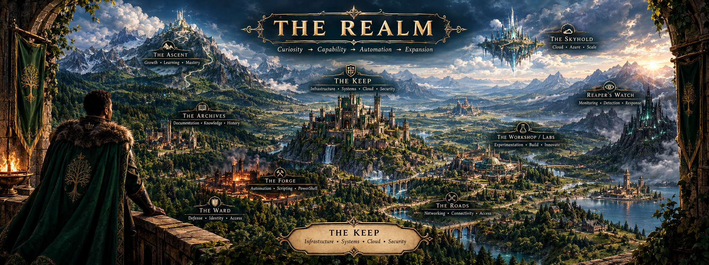
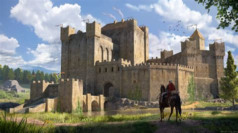
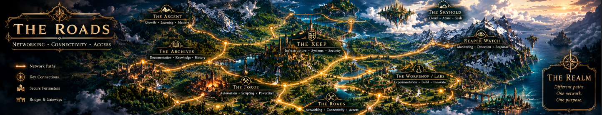
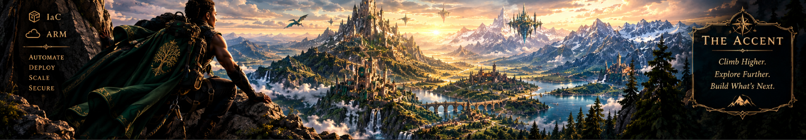
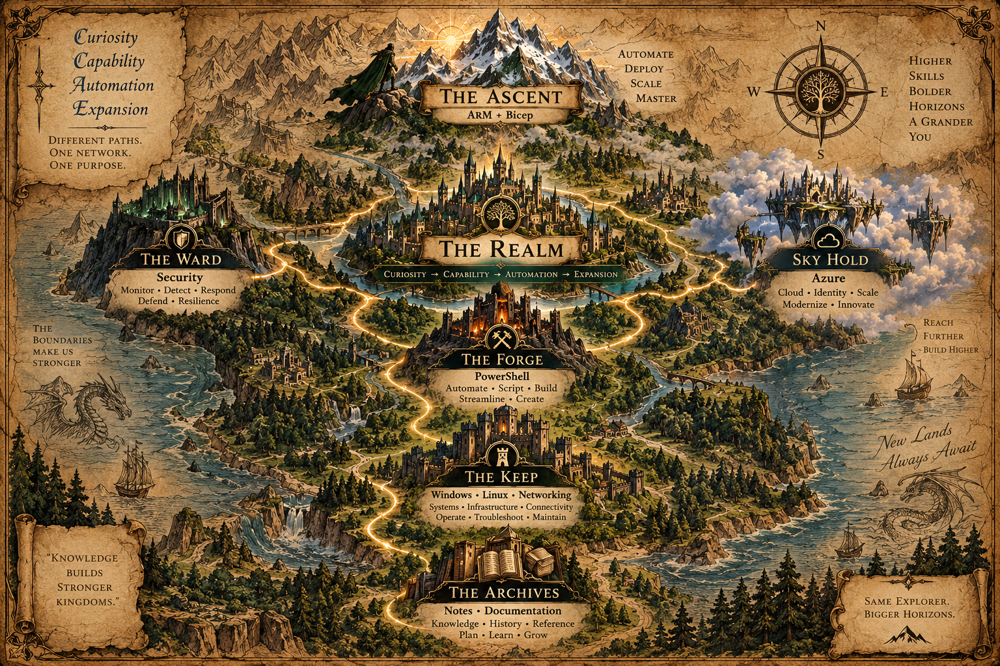

 

⚔️ THE REALM

THE HYBRID CLOUD INFRASTRUCTURE LAB

☁️ Azure   ✦   ⚙️ PowerShell   ✦   🛡️ Security   ✦   🏗️ Automation

 

Curiosity → Capability → Automation → Expansion

Build. Secure. Automate. Expand.

🧭 ENTER THE REALM

Welcome to THE REALM, my hands-on cloud infrastructure environment.

This is where I document the transition from systems administration into Azure infrastructure, PowerShell automation, and cloud security,building real environments, understanding how they work, securing them, and eventually defining them as code.

My purpose: Build the infrastructure. Secure the environment. Automate the work. Expand the capability.

 

<table>
<tr>
<td width="33%" valign="top">

🏰 SKY HOLD

AZURE INFRASTRUCTURE

Build the foundation.

Virtual Machines

Virtual Networks

Storage

Identity

Monitoring

Azure Security

<a href="https://github.com/Lglass510/The_Sky_Hold">→ Enter Sky Hold</a>

</td>

<td width="33%" valign="top">

⚙️ THE FORGE

POWERSHELL AUTOMATION

Turn knowledge into capability.

Azure Administration

PowerShell Scripts

Automation

Reporting

System Administration

Troubleshooting

<a href="https://github.com/Lglass510/The_Forge">→ Enter the Forge</a>

</td>

<td width="33%" valign="top">

🛡️ THE WARD

CLOUD SECURITY

Protect the environment.

Security+

Identity Security

Azure Security

Monitoring

Threat Detection

Hardening

<a href="https://github.com/Lglass510/The_Ward">→ Enter the Ward</a>

</td>
</tr>
</table>

🏛️ THE KEEP

SYSTEMS & INFRASTRUCTURE FOUNDATIONS

Before the cloud, there is infrastructure.

The Keep represents the foundation behind everything I build in Azure: understanding operating systems, identity, networking, and the systems that make modern infrastructure work.

⚔️ Foundation

Focus

🖥️ Windows

Administration & troubleshooting

👥 Active Directory

Identity & access

🐧 Linux

System administration

🌐 Networking

Connectivity & infrastructure

🖧 Virtualization

Hands-on environments

🔧 Troubleshooting

Understanding systems

Understand the system before attempting to automate it.

<a href="https://github.com/Lglass510/The_Keep">→ Enter the Keep</a>

📜 THE ARCHIVES

NOTES & DOCUMENTATION

The Archives are where knowledge becomes reusable.

Here I collect technical notes, command references, lessons learned, study material, and documentation from the environments I build.

📘 Azure Notes
⚙️ PowerShell Notes
🛡️ Security Notes
🐧 Linux Notes
🌐 Networking Notes
📋 Cheat Sheets
🧠 Lessons Learned

Knowledge preserved. Capability expanded.

<a href="https://github.com/Lglass510/The_Archives">→ Enter the Archives</a>

🌐 THE ROADS

CONNECTIVITY & ARCHITECTURE

Every system is connected.

The Roads are the darker side of the realm—a place where connectivity, exposure, routing, DNS, and network security meet.

🌐 Networking
🔗 Connectivity
📡 DNS
🔀 Routing
🛡️ Network Security
☁️ Azure Networking

Understand what connects the realm. Secure what crosses it.

<a href="https://github.com/Lglass510/The_Roads">→ Enter the Roads</a>

🏔️ THE ASCENT

INFRASTRUCTURE AS CODE

The next chapter is built higher.

My long-term progression moves from administering infrastructure to automating it and ultimately defining it as code.

Azure Administration
        ↓
PowerShell Automation
        ↓
Azure Security
        ↓
Azure CLI
        ↓
ARM Templates
        ↓
Bicep
        ↓
Infrastructure as Code

Future Focus

🏗️ ARM Templates
🏗️ Bicep
⚙️ Azure CLI
🔄 Automation
📦 Modular Deployments
🛡️ Secure Infrastructure

The goal is no longer simply managing infrastructure. The goal is defining infrastructure.

<a href="https://github.com/Lglass510/The_Sky_Hold">→ Begin the Ascent (in Sky Hold)</a>

⚔️ CURRENT QUESTS

🛡️ Security+

Strengthening and applying security fundamentals to the cloud environments I build.

☁️ Azure

Building practical cloud infrastructure and administration skills.

⚙️ PowerShell

Developing automation for infrastructure administration and Azure workflows.

🏔️ ARM + Bicep

Preparing to build repeatable infrastructure through code.

🗺️ THE ROADMAP

                         🏔️ THE ASCENT
                           ARM + Bicep
                                ↑
        🛡️ THE WARD  ←──────  The Realm  ──────→  🏰 SKY HOLD
          Security                              Azure
                                ↑
                          ⚙️ THE FORGE
                            PowerShell
                                ↑
                           🏛️ THE KEEP
                  Windows • Linux • Networking
                                ↑
                         📜 THE ARCHIVES
                      Notes • Documentation

⚔️ THE REALM PRINCIPLES

✦ Curiosity

Ask how the system works.

⚔️ Capability

Learn to build and administer it.

⚙️ Automation

Make the work repeatable.

🏔️ Expansion

Build something larger.

 

Curiosity → Capability → Automation → Expansion

 

☁️ Build the infrastructure.

🛡️ Secure the environment.

⚙️ Automate the work.

🏔️ Expand the capability.

 

The lab is never finished. The realm keeps expanding.

